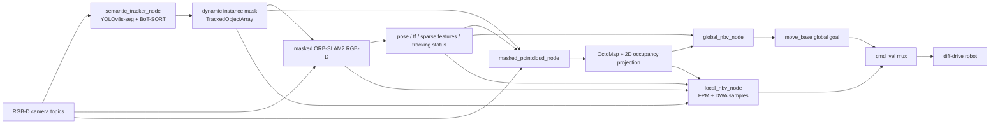

# Mutual Information Hierarchical NBV Active Semantic Visual SLAM 复现技术实施方案

> 当前约束：本仓库只在 Windows 下编写和维护文档/代码，不在 Windows 运行 ROS、Gazebo、ORB-SLAM2 或 CUDA 推理。实际编译、仿真和评测放到 Ubuntu 20.04 + ROS Noetic + Gazebo 环境执行。

## 1. 结论与复现策略

截至 2026-06-09，按论文题名、DOI `10.1038/s41598-026-36259-x`、作者名、`Feature Probability Map`、`hierarchical NBV semantic visual SLAM` 等关键词检索，没有找到这篇论文的官方 GitHub/代码仓库。论文网页可见 Supplementary Information，但未见代码仓库链接。因此复现应采用“论文算法重建 + 开源模块拼装 + 自写 NBV/FPM 核心”的路线。

推荐方案：

1. 使用 ROS Noetic catkin 工程组织代码，目标运行平台为 Ubuntu 20.04。
2. 使用 ORB-SLAM2 作为视觉 SLAM 基座，改造 RGB-D ROS 节点以发布位姿、稀疏特征、跟踪状态，并接收动态掩码用于剔除动态特征。
3. 使用 Python ROS 节点封装 YOLOv8s-seg + BoT-SORT，输出实例掩码、track id、bbox、像素速度和动态确认状态。
4. 使用 OctoMap / 2D occupancy grid 构建全局地图，动态区域不进入地图更新。
5. 自写全局 NBV：frontier 提取、DBSCAN 聚类、8 个 yaw 方向 ray casting、Shannon entropy / mutual information、移动代价归一化，输出 `move_base` goal。
6. 自写局部 NBV：ORB 特征概率图、动态目标各向异性高斯影响图、FPM 融合、下一视角 FPM 预测、DWA 可达候选采样，输出短时 `cmd_vel` 或局部目标。
7. 重建两个 Gazebo 仿真场景：`10 m x 10 m` 开阔环境和 `19 m x 22 m` 复杂环境，各有 2 个行人按固定轨迹往返。
8. 实验对比至少包括 `global_only` 和 `full_hierarchical`；可选补充 nearest frontier、RNE、TARE 作为基线。

## 2. 开源代码调研结果

| 类型 | 仓库/来源 | 能直接复用什么 | 注意事项 |
| --- | --- | --- | --- |
| 目标论文 | Nature / PMC 页面：`https://www.nature.com/articles/s41598-026-36259-x`、`https://pmc.ncbi.nlm.nih.gov/articles/PMC12894974/` | 算法、参数、实验配置、评价指标 | 未发现官方代码；网页未见代码仓库链接 |
| SLAM 基座 | ORB-SLAM2：`https://github.com/raulmur/ORB_SLAM2` | RGB-D SLAM、ROS 示例、稀疏地图、回环和重定位 | GPL；Ubuntu 20.04/OpenCV4 可能需要小补丁；需要改造动态特征掩码接口 |
| ROS 包装 | appliedAI `orb_slam_2_ros`：`https://github.com/appliedAI-Initiative/orb_slam_2_ros` | ROS 话题、TF、point cloud/pose 发布方式参考 | 可参考接口设计，但论文以 ORB-SLAM2 为基座，核心最好保持可控 |
| 主动视觉 SLAM | ExplORB-SLAM：`https://github.com/JulioPlaced/ExplORB-SLAM` | Ubuntu 20.04 + ROS Noetic + Gazebo 的 active visual SLAM 工程组织参考 | 决策函数是 pose-graph topology，不是本文 mutual information + FPM |
| 动态 SLAM | DynaSLAM：`https://github.com/BertaBescos/DynaSLAM` | ORB-SLAM2 上动态物体剔除的修改思路 | 依赖较旧 Mask R-CNN / Python2；不建议直接作为主工程 |
| 语义动态 SLAM | DS-SLAM：`https://github.com/ivipsourcecode/DS-SLAM` | 语义分割、动态特征剔除、OctoMap 语义建图参考 | Ubuntu 14.04/16.04、SegNet/Caffe 依赖老旧；只作为参考 |
| 论文基线 RNE | RNE/RNEX：`https://github.com/MarcoStb1993/rnexploration` | RRG + NBV 探索基线，可复现实验对比中的 RNE | C++ ROS 包，需单独适配地图和机器人接口 |
| 论文基线 TARE | TARE planner：`https://github.com/caochao39/tare_planner` | 层级探索基线，README 标明支持 Ubuntu 20.04 + ROS Noetic | 偏 3D exploration，作为对比基线，不作为本文核心实现 |
| 目标检测/跟踪 | Ultralytics + BoT-SORT 文档：`https://docs.ultralytics.com/modes/track/`、BoT-SORT：`https://github.com/NirAharon/BoT-SORT` | YOLOv8s-seg、BoT-SORT track id、Kalman 预测/关联思路 | Python 节点推理，需固定版本并记录模型权重 |

## 3. 目标系统架构

### 3.1 ROS 包划分

建议仓库根目录采用标准 catkin workspace 内的源码布局：

```text
hnbv_active_slam/
  README.md
  docs/
    reproduction_implementation_plan.md
    experiment_protocol.md
  third_party.repos
  requirements.txt
  hnbv_msgs/
    msg/
      TrackedObject.msg
      TrackedObjectArray.msg
      FeaturePointArray.msg
      PlannerDebug.msg
  hnbv_bringup/
    launch/
      sim_env1.launch
      sim_env2.launch
      hnbv_system.launch
      hnbv_eval.launch
    config/
      camera_realsense_d435.yaml
      global_nbv.yaml
      local_nbv.yaml
      move_base.yaml
      costmap_common.yaml
  hnbv_slam/
    src/
      orb_slam2_ros_rgbd_masked.cc
      dynamic_feature_filter.cc
      slam_state_publisher.cc
    include/hnbv_slam/
  hnbv_semantics/
    scripts/
      semantic_tracker_node.py
      mask_bridge_node.py
    config/
      yolov8_botsort.yaml
  hnbv_mapping/
    src/
      masked_pointcloud_node.cpp
      occupancy_projection_node.cpp
    config/
      octomap.yaml
  hnbv_planner/
    src/
      global_nbv_node.cpp
      frontier_extractor.cpp
      raycaster_2d.cpp
      local_nbv_node.cpp
      fpm_builder.cpp
      dwa_sampler.cpp
  hnbv_sim/
    worlds/
      env1_open_10x10.world
      env2_complex_19x22.world
    models/
      differential_rgbd_robot/
      walking_person/
    launch/
      spawn_env1.launch
      spawn_env2.launch
  hnbv_eval/
    scripts/
      run_experiment.py
      extract_rosbag.py
      compute_metrics.py
      compute_slam_metrics.py
      compute_map_metrics.py
      compute_active_metrics.py
      compute_dynamic_metrics.py
      compute_runtime_metrics.py
      aggregate_trials.py
      make_figures.py
      plot_trajectories.py
      export_tables.py
      make_report.py
    config/
      metric_thresholds.yaml
      figure_style.yaml
```

### 3.2 运行时数据流



## 4. ROS 消息与话题接口

### 4.1 自定义消息

`hnbv_msgs/TrackedObject.msg`

```text
int32 id
string class_name
int32 class_id
float32 confidence
sensor_msgs/RegionOfInterest bbox
geometry_msgs/Point32 centroid_px
geometry_msgs/Vector3 velocity_px
float32 speed_px_per_frame
float32 motion_angle_rad
bool geometry_dynamic
uint32 violation_count
```

`hnbv_msgs/TrackedObjectArray.msg`

```text
std_msgs/Header header
TrackedObject[] objects
```

`hnbv_msgs/FeaturePointArray.msg`

```text
std_msgs/Header header
geometry_msgs/Point32[] points_px
geometry_msgs/Point32[] points_world
uint8[] dynamic_flags
```

实例掩码不要放进 `TrackedObjectArray`，单独发布：

| Topic | Type | 说明 |
| --- | --- | --- |
| `/hnbv/semantics/instance_mask` | `sensor_msgs/Image`，`32SC1` | 每个像素为 track id；0 表示非动态实例 |
| `/hnbv/semantics/tracks` | `hnbv_msgs/TrackedObjectArray` | 每个实例的 id、bbox、速度、动态确认状态 |
| `/hnbv/slam/pose` | `geometry_msgs/PoseStamped` | ORB-SLAM2 当前相机/机器人位姿 |
| `/hnbv/slam/features` | `hnbv_msgs/FeaturePointArray` | 当前帧 ORB 特征像素坐标和世界点 |
| `/hnbv/slam/status` | `std_msgs/String` 或自定义状态 | `OK`、`RECENTLY_LOST`、`LOST` |
| `/hnbv/map/occupancy` | `nav_msgs/OccupancyGrid` | 2D 占据栅格，分辨率 0.05 m |
| `/hnbv/planner/global_goal` | `geometry_msgs/PoseStamped` | 全局 NBV 目标 |
| `/hnbv/planner/local_cmd_vel` | `geometry_msgs/Twist` | 局部 NBV 速度指令 |
| `/cmd_vel` | `geometry_msgs/Twist` | 经过 mux 后发给机器人 |

## 5. 核心算法实现细节

### 5.1 动态语义感知

输入为 RGB 图像。`semantic_tracker_node.py` 使用 `yolov8s-seg.pt`，只启用论文实验中的 `person` 类作为潜在动态物体：

- detection confidence：`0.8`
- NMS IoU：`0.45`
- BoT-SORT track max age / buffer：`30` frames
- BoT-SORT IoU matching threshold：`0.8`
- 输出每个 track 的中心点、像素速度、运动方向、实例掩码

动态确认采用语义候选 + 对极几何：

1. 对每个 track 维护最近帧的 ORB 匹配点。
2. 使用相邻帧匹配点估计 fundamental matrix。
3. 对落入该 track mask 的匹配点计算 Sampson distance。
4. 若残差超过阈值并连续超过 3 帧，则 `geometry_dynamic=true`。
5. 第一版可配置 `mask_all_people=true`，即所有 person mask 均先从 SLAM 和建图中剔除；完整复现时关闭该开关，按论文使用几何验证。

论文没有给出对极残差阈值，建议初值：

```yaml
epipolar:
  sampson_threshold_px: 2.0
  required_consecutive_frames: 3
  min_matches_per_object: 8
```

### 5.2 ORB-SLAM2 动态特征剔除

需要在 ORB-SLAM2 RGB-D ROS 节点中增加动态 mask 输入：

1. 同步 RGB、depth、camera_info、instance_mask。
2. 在 `Frame` 构建后过滤 ORB keypoints/descriptors：
   - 若 keypoint 像素在 `geometry_dynamic=true` 的 track mask 内，删除该 keypoint 和 descriptor row。
   - 若启用 `mask_all_people=true`，所有 person track 均删除。
3. 发布过滤后的 keypoints 到 `/hnbv/slam/features`。
4. 发布 tracking state；当 `LOST` 时计入 tracking loss。

实现上尽量少改 ORB-SLAM2 主库：新增 `hnbv_slam` 包中的 wrapper 和小补丁，保留 upstream 文件名与差异说明。若使用 GPL 的 ORB-SLAM2 代码，整个派生工程也要按 GPL 兼容方式发布。

### 5.3 建图与 2D occupancy

论文说先由 RGB-D 回投得到 3D dense map，再用 OctoMap 投影到 2D 栅格。实现建议：

1. `masked_pointcloud_node` 用 RGB-D + 当前位姿生成 `PointCloud2`。
2. 深度范围限制到 `0.1 m ~ 5.0 m`。
3. 若像素属于动态实例 mask，则跳过该深度点。
4. 输入 OctoMap server，分辨率 `0.05 m`。
5. `occupancy_projection_node` 将指定高度范围内的 OctoMap 投影到 `nav_msgs/OccupancyGrid`：
   - `occupied`：概率大于占据阈值
   - `free`：概率小于空闲阈值或 ray clearing 后空闲
   - `unknown`：未观测

仿真优先使用 Gazebo ground truth 深度和 ORB-SLAM2 位姿；如果 ORB-SLAM2 位姿不稳定，可临时开启 `use_ground_truth_pose_for_mapping=true` 做模块调试，但正式实验必须使用 SLAM 位姿。

### 5.4 全局 NBV

输入：`/hnbv/map/occupancy`、当前 pose、costmap 或 `move_base/NavfnROS` 路径长度。

流程：

1. frontier 提取：free cell 邻接 unknown cell 即 frontier。
2. DBSCAN 聚类：`eps_db=0.5 m`，`min_cluster_size=5`。
3. 每簇选代表候选点：簇质心投影到最近 free cell。
4. 对每个候选点计算 8 个 yaw：`0,45,...,315 deg`。
5. ray casting：FOV `90 deg`，max range `5.0 m`，遇 occupied cell 截断。
6. 可见 cell 信息增益：

```text
H(g) = -p(g) log2 p(g) - (1-p(g)) log2(1-p(g))
I(v,theta) = sum_{g in G_vis(v,theta)} H(g)
```

unknown cell 取 `p=0.5`，free/occupied 按 occupancy probability 或离散近似取 `p=0.01/0.99` 并 clamp，避免 `log(0)`。

7. 移动代价：

```text
c = lambda_d * path_length(x_t, v) + lambda_theta * abs(yaw_delta(x_t, theta))
S = I / (c + epsilon)
```

8. 选择 `S` 最大的 `(v*, theta*)`，发布到 `/move_base_simple/goal`。
9. 当最大信息增益小于环境阈值时停止探索：
   - Env 1：`50 bits`
   - Env 2：`260 bits`

初始参数：

```yaml
global_nbv:
  dbscan_eps_m: 0.5
  dbscan_min_samples: 5
  yaw_degrees: [0, 45, 90, 135, 180, 225, 270, 315]
  camera_fov_deg: 90
  max_range_m: 5.0
  lambda_d: 0.8
  lambda_theta: 1.0
  epsilon: 1.0e-6
  stop_gain_bits_env1: 50.0
  stop_gain_bits_env2: 260.0
```

### 5.5 全局 NBV 的局部补全

论文在全局 NBV 到达后，对全局目标邻域 `N(v*, theta*)` 做局部补全，以弥补单目/RGB-D 相机 FOV 受限问题。实现：

1. 当机器人到达全局 goal 半径 `0.3 m` 内，生成半径 `rho` 的局部候选点和 8 个 yaw。
2. 对每个候选重复全局 NBV 的 ray casting / entropy score。
3. 按 score 贪心访问，直到局部候选全部访问或局部增益低于阈值。
4. 再触发下一次全局 NBV。

建议参数：

```yaml
global_completion:
  enabled: true
  neighborhood_radius_m: 1.0
  candidate_spacing_m: 0.5
  arrival_radius_m: 0.3
  min_local_gain_bits: 5.0
```

### 5.6 FPM 构建

FPM = 当前稳定特征分布 + 动态目标运动影响。

特征概率图 `M_f`：

1. 从 `/hnbv/slam/features` 读取当前帧静态 ORB 特征点。
2. 将图像划分为网格。论文写 `640 x 480`，工程上建议支持两种模式：
   - `full`: 640 x 480，最贴论文，但 CPU 开销大；
   - `coarse`: 80 x 60 或 160 x 120，单元测试和实时调试用，最终可切回 full。
3. 每个 grid 统计特征数并除以总特征数 `K`。
4. Gaussian blur 平滑，最后归一化为概率分布。

动态影响图 `M_t`：

1. 对每个动态 track 的 mask 像素或下采样 mask 像素放置各向异性高斯核。
2. 高斯中心为动态像素或 track 预测像素。
3. 运动方向来自 track centroid 的像素速度方向。
4. 协方差：

```text
sigma_parallel = alpha * (speed_px_per_frame + epsilon)
sigma_perp = beta * (speed_px_per_frame + epsilon)
Sigma_r = R(theta) diag(sigma_parallel^2, sigma_perp^2) R(theta)^T
```

5. 将所有动态概率累加并归一化，最后按论文写法生成反向可见性：

```text
M_t(x) = 1 - dynamic_prob_normalized(x)
M(x) = normalize(M_f(x) + M_t(x))
```

注意：论文公式 `M_t = 1 - normalized_dynamic_prob` 后再和 `M_f` 相加，会让大面积非动态区域产生较大常量背景。为保证复现忠实性，默认按论文实现；同时保留 `dynamic_weight`、`feature_weight`、`mt_centering` 参数，实验记录中必须说明是否使用修正。

初始参数：

```yaml
local_nbv:
  rate_hz: 10
  fpm_width: 640
  fpm_height: 480
  fpm_debug_width: 160
  fpm_debug_height: 120
  gaussian_blur_kernel: 7
  alpha: 1.5
  beta: 0.5
  epsilon: 0.01
  feature_weight: 1.0
  dynamic_weight: 1.0
```

### 5.7 下一视角 FPM 预测

对每个候选视角 `view`：

1. 特征预测：
   - 如果候选视角覆盖已建图区域，从稀疏 map points 投影到候选相机平面，统计特征密度。
   - 如果候选视角朝向未知区域，用最近相邻已探索区域的特征密度近似。
2. 动态物体预测：
   - 使用 BoT-SORT / Kalman state 的 constant velocity 预测下一帧 bbox/centroid。
   - mask 可先用当前 mask 平移近似；完整版本再做 per-pixel KF 或按论文“每个 mask pixel 独立 KF”实现。
3. 用预测特征 `M_f^p` 和预测动态图 `M_t^p` 生成 `M^p`。
4. 熵：

```text
H(M) = -sum_x M(x) log2 M(x)
I_local(view) = H(M_current) - H(M_predicted(view))
```

如果发现 `H(current)-H(predicted)` 总为负或与直觉相反，需要在实验日志中检查 FPM 定义。可保留一个 ablation：直接最大化 `sum(M_predicted)` 或最小化动态覆盖，但主结果仍先按论文 mutual information 公式跑。

### 5.8 DWA 可达候选与速度输出

论文使用 differential-drive + DWA，速度约束：

```yaml
dwa:
  max_linear_velocity: 0.2
  max_angular_velocity: 0.2
  horizon_s: 1.0
  dt_s: 0.1
  linear_samples: 5
  angular_samples: 9
```

实现方式：

1. 从当前 `(v, omega)` 动态窗口采样候选速度。
2. 前向 rollout `1 s`，剔除碰撞或越界轨迹。
3. 将候选终点视作下一视角，计算 `I_local`。
4. 目标函数：

```text
J = w_info * I_local - w_collision * obstacle_cost - w_goal * distance_to_global_goal - w_smooth * cmd_delta
```

5. 当检测到动态目标进入 FOV、机器人靠近行人、或进入全局 NBV 的局部补全阶段时，局部 NBV 接管 `cmd_vel`；否则 `move_base` 控制。
6. 使用 `twist_mux` 或自写简单 mux：
   - `local_nbv` priority 高于 `move_base`
   - 接管超时 `0.3 s`
   - SLAM `LOST` 时发零速并记录 tracking loss

## 6. Ubuntu 20.04 运行方案

### 6.1 系统依赖

Ubuntu 20.04 机器上执行。Windows 只负责编辑和 git 提交。

```bash
sudo apt update
sudo apt install -y \
  build-essential cmake git wget curl \
  python3-pip python3-venv python3-rosdep python3-catkin-tools python3-vcstool \
  libopencv-dev libeigen3-dev libboost-all-dev libsuitesparse-dev \
  ros-noetic-desktop-full \
  ros-noetic-navigation ros-noetic-move-base ros-noetic-dwa-local-planner \
  ros-noetic-octomap ros-noetic-octomap-server ros-noetic-octomap-ros ros-noetic-octomap-rviz-plugins \
  ros-noetic-tf2-ros ros-noetic-tf2-geometry-msgs ros-noetic-message-filters \
  ros-noetic-cv-bridge ros-noetic-image-transport ros-noetic-image-geometry \
  ros-noetic-gazebo-ros ros-noetic-gazebo-plugins ros-noetic-robot-state-publisher \
  ros-noetic-xacro ros-noetic-rviz
```

首次使用 ROS 依赖：

```bash
sudo rosdep init || true
rosdep update
```

Python 依赖建议用仓库内 `requirements.txt` 固定版本。初版可包含：

```text
numpy
scipy
scikit-learn
opencv-python
ultralytics
lap
filterpy
pyyaml
evo
```

安装：

```bash
python3 -m pip install --user -r ~/catkin_hnbv/src/hnbv_active_slam/requirements.txt
```

### 6.2 获取仓库并构建

假设后续仓库已经上传 Git：

```bash
mkdir -p ~/catkin_hnbv/src
cd ~/catkin_hnbv/src
git clone <YOUR_GIT_REPO_URL> hnbv_active_slam
```

如果使用 `.repos` 管理 ORB-SLAM2、TARE/RNE 等第三方仓库：

```bash
cd ~/catkin_hnbv/src
vcs import . < hnbv_active_slam/third_party.repos
```

安装 ROS 依赖：

```bash
cd ~/catkin_hnbv
rosdep install --from-paths src --ignore-src -r -y
```

构建：

```bash
source /opt/ros/noetic/setup.bash
catkin config --extend /opt/ros/noetic --cmake-args -DCMAKE_BUILD_TYPE=Release
catkin build
source devel/setup.bash
```

如果 ORB-SLAM2 在 Ubuntu 20.04 上因 OpenCV4、Pangolin、C++ 标准报错，处理顺序：

1. 先单独构建 ORB-SLAM2，确认 `RGBD` 示例能跑 TUM RGB-D。
2. 固定 OpenCV include/link 版本，CMake 使用 `find_package(OpenCV REQUIRED)`。
3. 将 C++ 标准统一到 C++14。
4. Pangolin 用系统 apt 或源码固定版本，记录 commit。
5. 再构建 `hnbv_slam` wrapper。

### 6.3 下载模型和词袋

```bash
cd ~/catkin_hnbv/src/hnbv_active_slam
mkdir -p models/yolo models/orb
python3 - <<'PY'
from ultralytics import YOLO
YOLO("yolov8s-seg.pt")
PY
```

将 ORB-SLAM2 的 `ORBvoc.txt` 放到：

```text
~/catkin_hnbv/src/hnbv_active_slam/models/orb/ORBvoc.txt
```

后续可在 `hnbv_bringup/config/orb_slam2_rgbd.yaml` 中配置路径。

### 6.4 启动 Env 1 仿真

终端 1：

```bash
source ~/catkin_hnbv/devel/setup.bash
roslaunch hnbv_bringup sim_env1.launch
```

终端 2：

```bash
source ~/catkin_hnbv/devel/setup.bash
roslaunch hnbv_bringup hnbv_system.launch env:=env1 mode:=full_hierarchical
```

终端 3，可选记录：

```bash
source ~/catkin_hnbv/devel/setup.bash
mkdir -p ~/hnbv_runs/env1_full
rosbag record -O ~/hnbv_runs/env1_full/run.bag \
  /tf /tf_static \
  /camera/color/image_raw /camera/aligned_depth_to_color/image_raw /camera/camera_info \
  /hnbv/semantics/tracks /hnbv/semantics/instance_mask \
  /hnbv/slam/pose /hnbv/slam/status /hnbv/slam/features \
  /hnbv/map/occupancy /hnbv/planner/global_goal /hnbv/planner/local_cmd_vel \
  /cmd_vel /gazebo/model_states
```

启动探索：

```bash
rosservice call /hnbv/start "{}"
```

### 6.5 启动 Env 2 仿真

```bash
source ~/catkin_hnbv/devel/setup.bash
roslaunch hnbv_bringup sim_env2.launch
```

另一个终端：

```bash
source ~/catkin_hnbv/devel/setup.bash
roslaunch hnbv_bringup hnbv_system.launch env:=env2 mode:=full_hierarchical
rosservice call /hnbv/start "{}"
```

### 6.6 跑消融与基线

只启用全局 NBV：

```bash
roslaunch hnbv_bringup hnbv_system.launch env:=env1 mode:=global_only
```

完整分层 NBV：

```bash
roslaunch hnbv_bringup hnbv_system.launch env:=env1 mode:=full_hierarchical
```

最近 frontier baseline：

```bash
roslaunch hnbv_bringup baseline_nearest_frontier.launch env:=env1
```

RNE/TARE 基线建议放在第二阶段：

1. 先在独立 workspace 跑通其官方 demo。
2. 接入本工程的 Gazebo robot、OctoMap/occupancy topic、`move_base`。
3. 只比较最终指标，不混入本方法的 FPM/semantic local NBV。

## 7. 实验复现配置

### 7.1 论文实验参数

| 项目 | 参数 |
| --- | --- |
| OS | Ubuntu 20.04 |
| ROS | ROS 1 / Noetic |
| 仿真 | Gazebo |
| 相机 | RGB-D，分辨率 `640 x 480` |
| 相机内参 | `fx=573.4, fy=574.8, cx=320.1, cy=322.6` |
| 深度最大有效距离 | `5.0 m` |
| YOLO | YOLOv8s，COCO pretrained，无额外 fine-tune |
| detection confidence | `0.8` |
| NMS IoU | `0.45` |
| 动态类别 | 实验只用 `person` |
| BoT-SORT max age | `30 frames` |
| BoT-SORT IoU threshold | `0.8` |
| 机器人线速度 | `0.2 m/s` |
| 机器人角速度 | `0.2 rad/s` |
| grid map resolution | `0.05 m/cell` |
| Env 1 | `10 m x 10 m`，2 个行人往返 |
| Env 2 | `19 m x 22 m`，复杂布局，2 个行人往返 |
| Env 1 停止阈值 | global NBV gain `< 50 bits` |
| Env 2 停止阈值 | global NBV gain `< 260 bits` |

### 7.2 评价闭环定义

主动 SLAM 的评估不能只看最终轨迹误差。完整闭环定义为：

```text
Perception -> SLAM -> Mapping -> NBV Decision -> Motion Execution -> New Observation -> Metrics
```

每一次实验 trial 必须记录同一套输入、输出和中间决策，保证结果可以从 rosbag 离线重算。闭环以一次探索任务为单位：

1. 初始条件固定：同一 Gazebo world、同一机器人初始位姿、同行人轨迹脚本、同一随机种子。
2. 在线系统运行：语义跟踪、动态特征剔除、SLAM、建图、全局 NBV、局部 NBV 和运动控制全部开启或按 mode 做消融。
3. 终止条件固定：global NBV 最大增益低于环境阈值、达到最大时间、达到最大距离、或 SLAM 长时间 lost。
4. 离线评估重算：从 rosbag 提取轨迹、地图、NBV 决策、FPM、动态目标和 runtime trace，生成 `metrics.json`、`metrics.csv`、图表和 Markdown 报告。
5. 多 trial 统计：每个方法每个环境至少 5 次，输出均值、标准差、95% confidence interval，以及相对 `global_only` 的改进比例。

推荐结果目录：

```text
~/hnbv_runs/
  env1/
    full_hierarchical/
      trial_001/
        run.bag
        manifest.yaml
        events.csv
        trajectories/
          groundtruth.tum
          estimate.tum
        maps/
          occupancy_initial.npy
          occupancy_final.npy
          entropy_timeseries.csv
        planner/
          nbv_decisions.csv
          local_cmd_vel.csv
          fpm_snapshots/
        metrics.json
        figures/
        report.md
      summary.csv
      aggregate_report.md
```

`manifest.yaml` 必须记录 git commit、配置文件 hash、模型权重 hash、world 名称、随机种子、ROS 参数 dump、开始/结束时间和终止原因。没有 manifest 的实验不进入最终统计。

### 7.3 评估指标体系

`hnbv_eval/compute_metrics.py` 作为总入口，调用各子模块从 rosbag 和中间文件输出以下指标。

#### 7.3.1 任务完成与主动探索效率

| 指标 | 公式/定义 | 说明 |
| --- | --- | --- |
| Travel Time | `t_end - t_start` | 探索总时间，单位秒/分钟 |
| Travel Distance | `sum ||p_t - p_{t-1}||` | 机器人实际行驶距离 |
| Exploration Success | `gain < threshold and tracking_not_lost` | 是否正常完成探索 |
| Stop Reason | `low_gain / timeout / max_distance / tracking_lost / collision` | 终止原因分类 |
| Coverage Ratio | `N_known / N_total_roi` | ROI 内已知栅格比例 |
| Free-space Coverage | `N_known_free / N_gt_free` | 有 ground truth map 时使用 |
| Time to Coverage | `T(C >= 70/80/90/95%)` | 到达指定覆盖率所需时间 |
| Distance to Coverage | `D(C >= 70/80/90/95%)` | 到达指定覆盖率所需距离 |
| Exploration Rate | `dC/dt` 或 `known_area / time` | 覆盖增长速度 |
| Redundant Revisiting Ratio | `visited_known_cells / visited_total_cells` | 重复访问比例 |
| Path Efficiency | `known_area / travel_distance` | 单位距离带来的有效探索面积 |
| NBV Decision Latency | 每次全局/局部 NBV 计算耗时 | 主动决策实时性 |

#### 7.3.2 地图质量与信息增益

| 指标 | 公式/定义 | 说明 |
| --- | --- | --- |
| Initial Entropy | `H(G0)` | 初始地图不确定性 |
| Final Entropy | `H(GT)` | 终止时地图不确定性 |
| Entropy Reduction | `H(G0)-H(GT)` | 总信息收益 |
| ERR | `(H(G0)-H(GT))/Ttravel` | 论文主指标，bits/s |
| Entropy per Meter | `(H(G0)-H(GT))/TravelDistance` | 单位距离信息收益 |
| Mean NBV Gain | `mean(I_global)` | 全局 NBV 候选选中增益均值 |
| Gain Prediction Error | `predicted_gain - realized_gain` | NBV 预测与实际熵下降差异 |
| Occupancy Accuracy | `(TP+TN)/(TP+TN+FP+FN)` | 有 ground truth occupancy 时使用 |
| Occupancy IoU | `IoU(occupied_pred, occupied_gt)` | 障碍物建图质量 |
| Free-space IoU | `IoU(free_pred, free_gt)` | 可通行区域建图质量 |
| Unknown Ratio | `N_unknown/N_total_roi` | 未探索比例 |
| Dynamic Residual Ratio | 动态目标区域残留占据点比例 | 衡量动态物体是否污染地图 |

熵统一用 `log2`，单位为 bits：

```text
H(G) = sum_i [-p_i log2(p_i) - (1-p_i) log2(1-p_i)]
```

`p_i` 对 unknown 取 `0.5`；free/occupied 若只有离散值，取 `0.01/0.99` 并 clamp 到 `[1e-6, 1-1e-6]`。

#### 7.3.3 SLAM 定位精度与鲁棒性

| 指标 | 公式/定义 | 说明 |
| --- | --- | --- |
| ATE RMSE/Mean/Median/Max | `evo_ape` 输出 | 全局轨迹误差 |
| RPE Trans. RMSE/Mean/Max | `evo_rpe` 输出 | 局部平移漂移 |
| RPE Rot. RMSE/Mean/Max | `evo_rpe` 输出 | 局部旋转漂移 |
| Scale Drift | 轨迹长度比或 Sim(3) 对齐残差 | RGB-D 通常应较小 |
| Tracking Loss Rate | `N_lost_frames/N_total_frames * 100` | 论文主鲁棒性指标 |
| Tracking Loss Count | lost event 次数 | 连续 lost 算一次 event |
| Mean Relocalization Time | lost 到重新 OK 的平均时间 | 若 ORB-SLAM2 能恢复 |
| Valid Tracking Ratio | `N_ok_frames/N_total_frames` | 可用定位帧比例 |
| Feature Count Mean/Min | 静态 ORB 特征数量 | 低纹理/遮挡风险 |
| Static Feature Retention | `N_static_after_mask/N_features_raw` | 动态剔除后的有效特征保留率 |

建议使用 `evo` 计算 ATE/RPE：

```bash
evo_ape tum groundtruth.tum estimate.tum -a --save_results ape.zip
evo_rpe tum groundtruth.tum estimate.tum -a --delta 1 --delta_unit f --save_results rpe.zip
```

#### 7.3.4 动态环境鲁棒性与安全性

| 指标 | 公式/定义 | 说明 |
| --- | --- | --- |
| Near Collision Count | 距离动态目标 `< 2 m` 且持续 `> 3 s` 的事件数 | 论文 Table 5 指标 |
| Minimum Dynamic Distance | `min distance(robot, person)` | 最小安全距离 |
| Time Near Dynamic Objects | `sum dt(distance < 2 m)` | 暴露在动态目标附近的总时间 |
| Dynamic Object In-FOV Ratio | 行人在相机 FOV 内的时间占比 | local NBV 应降低该值 |
| Dynamic Mask Area Ratio | `dynamic_mask_pixels/image_pixels` | 动态遮挡强度 |
| Static Feature Occlusion Risk | 动态 mask 覆盖静态特征预测区域比例 | FPM 风险指标 |
| Dynamic Feature Rejection Rate | 被剔除动态特征数/原始特征数 | 动态前端是否生效 |
| False Dynamic Rejection Proxy | 静态区域被 mask 删除的特征比例 | 没有人工标注时作为代理指标 |

距离动态目标优先使用 Gazebo `/gazebo/model_states` 的机器人和 person 模型位姿计算；真实机器人实验用检测 bbox + 深度估计近似距离，并在报告中标记为 proxy。

#### 7.3.5 语义检测与跟踪质量

如果 Gazebo 中可获得 person ground truth，输出：

| 指标 | 公式/定义 | 说明 |
| --- | --- | --- |
| Detection Precision/Recall/F1 | bbox 或 mask IoU 匹配 | YOLO 检测可靠性 |
| Mask IoU | `IoU(mask_pred, mask_gt)` | 分割质量 |
| ID Switches | track id 变化次数 | BoT-SORT 稳定性 |
| MOTA / IDF1 | 多目标跟踪标准指标 | 可选，需实现匹配 |
| Track Fragmentation | 同一目标被分裂的次数 | 影响速度预测 |
| Velocity Prediction Error | `||v_pred - v_gt||` | local FPM 动态预测质量 |

没有像素级 ground truth mask 时，至少保留 bbox-level precision/recall 和 ID switch 统计；报告中明确标记 mask 指标不可用。

#### 7.3.6 局部 NBV / FPM 决策质量

| 指标 | 公式/定义 | 说明 |
| --- | --- | --- |
| FPM Entropy Current | `H(M)` | 当前特征可观测性不确定性 |
| FPM Entropy Predicted | `H(M^p)` | 候选下一视角预测熵 |
| Local MI | `H(M)-H(M^p)` | 论文局部 NBV 核心指标 |
| Local Override Count | local NBV 接管次数 | 接管频率 |
| Local Override Duration | local NBV 接管总时长 | 对全局路径影响 |
| Command Smoothness | `sum ||u_t-u_{t-1}||` | 控制稳定性 |
| Detour Ratio | `actual_path_length/global_path_length` | 局部避让带来的绕行 |
| FPM-Dynamic Overlap | FPM 高风险区域与动态 mask overlap | 动态预测是否影响决策 |
| Feature Recovery After Avoidance | 接管前后静态特征数量变化 | local NBV 是否提升可跟踪特征 |

这些指标用于解释“为什么 full hierarchical 比 global only 更稳”，不能只看最终 ATE。

#### 7.3.7 实时性与资源消耗

| 指标 | 公式/定义 | 说明 |
| --- | --- | --- |
| Module Runtime Mean/P95/Max | 每个节点 callback 耗时 | 对齐论文 Table 6 |
| SLAM FPS | ORB-SLAM2 有效处理帧率 | CPU 端压力 |
| YOLO FPS | 语义推理帧率 | GPU 端压力 |
| End-to-End Latency | 图像时间戳到 cmd_vel 输出 | 闭环延迟 |
| CPU Usage | process CPU percent | 可用 `psutil`/`pidstat` |
| GPU Usage | GPU utilization / memory | 可用 `nvidia-smi` |
| Dropped Frame Ratio | 未处理图像帧比例 | 实时系统稳定性 |

每个 ROS 节点应发布 `/hnbv/runtime/<module_name>` 或写入 `events.csv`，字段包括 `stamp,module,event,duration_ms,extra_json`。

### 7.4 可视化图表与报告产物

`hnbv_eval/make_figures.py` 和 `make_report.py` 需要生成以下图表。每张图保存 `.png` 和 `.pdf` 两种格式，关键数据另存 `.csv`。

| 图表 | 文件名 | 内容 |
| --- | --- | --- |
| 轨迹对比图 | `trajectory_overlay.png` | ground truth、estimated trajectory、global NBV goal、local override 片段、near collision 标记 |
| 最终地图对比 | `final_map_overlay.png` | occupancy grid、robot path、动态目标残留区域 |
| 覆盖率曲线 | `coverage_over_time.png` | coverage ratio vs time，不同方法同图 |
| 熵下降曲线 | `entropy_over_time.png` | map entropy vs time / distance |
| ERR 柱状图 | `err_bar_ci.png` | 多 trial 均值和 95% CI |
| ATE/RPE 箱线图 | `slam_error_boxplot.png` | 各方法定位误差分布 |
| Tracking loss 时间轴 | `tracking_state_timeline.png` | OK/LOST 状态随时间变化 |
| 动态距离曲线 | `dynamic_distance_timeline.png` | robot-person 最小距离，标出 2 m 阈值 |
| near collision 事件图 | `near_collision_events.png` | 事件发生时间和持续时间 |
| FPM 快照拼图 | `fpm_snapshot_grid.png` | RGB、mask、feature map、dynamic map、FPM、selected local view |
| NBV 候选热力图 | `global_nbv_candidates.png` | frontier candidates、score、最终选择方向 |
| local NBV 接管图 | `local_override_timeline.png` | 接管时段、cmd_vel、特征数量变化 |
| 模块耗时图 | `runtime_breakdown.png` | SLAM、YOLO、BoT-SORT、global NBV、local NBV、motion planning |
| 消融雷达图 | `ablation_radar.png` | efficiency、accuracy、robustness、safety、runtime 综合归一化 |
| 统计汇总表 | `summary_table.md/.csv` | 论文 Table 3/4/5/6 风格结果 |

报告 `report.md` 固定包含：

1. 实验配置和 manifest 摘要。
2. 终止原因和任务完成情况。
3. 主指标表：Travel Distance、Travel Time、ATE、RPE、ERR、Tracking loss、Near collision。
4. 主动 SLAM 扩展指标表：coverage、entropy per meter、redundant revisiting、detour ratio。
5. 动态环境指标表：dynamic distance、in-FOV ratio、mask area、feature recovery。
6. 实时性表：mean/P95/max runtime、FPS、dropped frame。
7. 图表索引和关键结论。

### 7.5 评估模块实现方案

`hnbv_eval` 按离线可复算原则实现，所有指标都从 rosbag、CSV 和配置文件生成，不依赖在线节点的临时打印。

```text
extract_rosbag.py
  输入 run.bag，导出 pose、tf、occupancy、tracks、planner events、cmd_vel、runtime 到 CSV/NPY/TUM。

compute_slam_metrics.py
  调 evo 或内部实现计算 ATE/RPE/tracking loss/feature count。

compute_map_metrics.py
  计算 coverage、entropy、ERR、occupancy IoU、dynamic residual。

compute_active_metrics.py
  计算 travel distance/time、NBV gain、gain prediction error、revisit、detour、path efficiency。

compute_dynamic_metrics.py
  计算 near collision、dynamic distance、in-FOV ratio、mask area、dynamic feature rejection。

compute_runtime_metrics.py
  计算各模块耗时、FPS、latency、CPU/GPU 资源。

aggregate_trials.py
  聚合同一 env/mode 多 trial，输出 mean/std/CI、显著性检验和改进百分比。

make_figures.py
  读取 metrics 和 CSV 生成所有图。

make_report.py
  生成 trial report 和 aggregate report。
```

建议 `metrics.json` schema：

```json
{
  "run_id": "env1_full_hierarchical_trial_001",
  "env": "env1",
  "mode": "full_hierarchical",
  "stop_reason": "low_gain",
  "success": true,
  "efficiency": {
    "travel_time_s": 258.0,
    "travel_distance_m": 24.2,
    "coverage_final": 0.94,
    "path_efficiency_m2_per_m": 1.8
  },
  "mapping": {
    "entropy_initial_bits": 12000.0,
    "entropy_final_bits": 1800.0,
    "err_bits_per_s": 39.5
  },
  "slam": {
    "ate_rmse_m": 0.25,
    "rpe_trans_rmse_m": 0.21,
    "rpe_rot_rmse_rad": 0.13,
    "tracking_loss_rate": 0.10
  },
  "dynamic": {
    "near_collision_count": 1,
    "min_dynamic_distance_m": 1.35,
    "dynamic_in_fov_ratio": 0.22
  },
  "runtime": {
    "slam_mean_ms": 132.0,
    "yolo_mean_ms": 32.0,
    "botsort_mean_ms": 24.0,
    "global_nbv_mean_ms": 87.0,
    "local_nbv_mean_ms": 64.0
  }
}
```

批量运行与出图命令：

```bash
python3 src/hnbv_active_slam/hnbv_eval/scripts/run_experiment.py \
  --env env1 --mode full_hierarchical --trials 5 --record-bag

python3 src/hnbv_active_slam/hnbv_eval/scripts/compute_metrics.py \
  --run_dir ~/hnbv_runs/env1/full_hierarchical/trial_001

python3 src/hnbv_active_slam/hnbv_eval/scripts/aggregate_trials.py \
  --root ~/hnbv_runs --env env1 --modes global_only full_hierarchical nearest_frontier

python3 src/hnbv_active_slam/hnbv_eval/scripts/make_figures.py \
  --root ~/hnbv_runs --env env1 --out ~/hnbv_runs/env1/figures

python3 src/hnbv_active_slam/hnbv_eval/scripts/make_report.py \
  --root ~/hnbv_runs --env env1 --out ~/hnbv_runs/env1/aggregate_report.md
```

### 7.6 目标复现实验表

第一阶段必须生成：

| Env | Method |
| --- | --- |
| Env 1 | Proposed global only |
| Env 1 | Proposed full hierarchical |
| Env 2 | Proposed global only |
| Env 2 | Proposed full hierarchical |

第二阶段补充：

| Env | Method |
| --- | --- |
| Env 1/2 | Nearest frontier |
| Env 1/2 | RNE |
| Env 1/2 | TARE |

论文 Table 5 在本地 Markdown 的表格抽取不完整，但正文给出：

- Env 1：global only tracking loss `30%`，full `10%`；near collision `5 -> 1`
- Env 2：global only tracking loss `20%`，full `10%`；near collision `7 -> 2`

这些值作为趋势参考，不应作为硬性断言；我们重建的 Gazebo world、行人轨迹和 ORB-SLAM2 版本不同，数值可能不完全一致。

## 8. 开发里程碑

### M0：仓库骨架和 Ubuntu 可构建

- 建立 catkin 包结构、README、requirements、launch/config 目录。
- Ubuntu 20.04 上 `catkin build` 通过。
- Gazebo 中机器人、RGB-D camera、固定行人模型能启动。

验收：

```bash
catkin build
roslaunch hnbv_bringup sim_env1.launch
rostopic hz /camera/color/image_raw
rostopic hz /camera/aligned_depth_to_color/image_raw
```

### M1：ORB-SLAM2 RGB-D 跑通

- ORB-SLAM2 在仿真 RGB-D topic 上输出 pose。
- 发布 `/hnbv/slam/pose`、`/hnbv/slam/features`、`/hnbv/slam/status`。
- 支持保存 TUM trajectory。

验收：

```bash
roslaunch hnbv_bringup hnbv_slam_only.launch env:=env1
rostopic echo -n 1 /hnbv/slam/pose
```

### M2：YOLOv8 + BoT-SORT 语义跟踪跑通

- 发布 `/hnbv/semantics/instance_mask` 和 `/hnbv/semantics/tracks`。
- RViz 或 debug image 能显示 person mask、track id、速度箭头。

验收：

```bash
roslaunch hnbv_bringup semantics_only.launch
rostopic echo -n 1 /hnbv/semantics/tracks
```

### M3：动态特征剔除 + masked mapping

- ORB-SLAM2 动态 mask 过滤生效。
- pointcloud 建图跳过动态像素。
- 动态行人不会大量留在 OctoMap/2D occupancy 中。

验收：

```bash
roslaunch hnbv_bringup hnbv_mapping_debug.launch env:=env1
rostopic echo -n 1 /hnbv/map/occupancy
```

### M4：全局 NBV

- frontier、DBSCAN、ray casting、entropy score 有单元测试。
- RViz 显示 candidate points、selected NBV pose/yaw。
- robot 能从一个 NBV 自动移动到下一个 NBV。

验收：

```bash
rostest hnbv_planner test_global_nbv.test
roslaunch hnbv_bringup hnbv_system.launch env:=env1 mode:=global_only
```

### M5：局部 FPM + DWA NBV

- FPM debug image 能显示特征分布、动态影响、融合图。
- 动态目标进入 FOV 时，local NBV 能短时接管速度，避开动态遮挡并朝高特征区域转向。
- 输出 `full_hierarchical` 与 `global_only` 的消融结果。

验收：

```bash
rostest hnbv_planner test_fpm_builder.test
roslaunch hnbv_bringup hnbv_system.launch env:=env1 mode:=full_hierarchical
```

### M6：完整评估闭环、指标与可视化复现

- `run_experiment.py` 可重复跑 N 次并保存 rosbag、trajectory、planner events、runtime trace 和 manifest。
- `extract_rosbag.py` 将 rosbag 离线转换为 TUM trajectory、CSV、NPY map 和 FPM snapshots。
- `compute_metrics.py` 汇总 SLAM、mapping、active exploration、dynamic safety、semantic tracking、runtime 六类指标。
- `aggregate_trials.py` 输出 mean/std/95% CI、相对改进比例和多 trial summary。
- `make_figures.py` 输出轨迹、地图、覆盖率、熵、ATE/RPE、tracking loss、动态距离、FPM、NBV 候选、runtime 等图表。
- `make_report.py` 生成 trial report 和 aggregate report。

验收：

```bash
python3 src/hnbv_active_slam/hnbv_eval/scripts/run_experiment.py \
  --env env1 --mode full_hierarchical --trials 5 --record-bag

python3 src/hnbv_active_slam/hnbv_eval/scripts/compute_metrics.py \
  --run_dir ~/hnbv_runs/env1/full_hierarchical/trial_001

python3 src/hnbv_active_slam/hnbv_eval/scripts/aggregate_trials.py \
  --root ~/hnbv_runs --env env1 --modes global_only full_hierarchical

python3 src/hnbv_active_slam/hnbv_eval/scripts/make_figures.py \
  --root ~/hnbv_runs --env env1 --out ~/hnbv_runs/env1/figures

python3 src/hnbv_active_slam/hnbv_eval/scripts/make_report.py \
  --root ~/hnbv_runs --env env1 --out ~/hnbv_runs/env1/aggregate_report.md
```

验收文件：

```text
~/hnbv_runs/env1/full_hierarchical/trial_001/metrics.json
~/hnbv_runs/env1/full_hierarchical/trial_001/report.md
~/hnbv_runs/env1/summary.csv
~/hnbv_runs/env1/aggregate_report.md
~/hnbv_runs/env1/figures/trajectory_overlay.png
~/hnbv_runs/env1/figures/coverage_over_time.png
~/hnbv_runs/env1/figures/entropy_over_time.png
~/hnbv_runs/env1/figures/slam_error_boxplot.png
~/hnbv_runs/env1/figures/runtime_breakdown.png
```

## 9. 测试计划

### 9.1 单元测试

必须覆盖：

- `entropy(p)`：`p=0.5` 最大，`p=0/1` 接近 0，使用 log2。
- `frontier_extractor`：合成 occupancy grid 中正确提取 free/unknown 边界。
- `dbscan_frontiers`：0.5 m 半径聚类后代表点在 free cell。
- `raycaster_2d`：FOV、range、occupied 截断正确。
- `score_global_nbv`：同样信息增益下偏好低路径/低转角成本。
- `fpm_builder`：`M_f`、`M_t`、`M` 都归一化，无 NaN/Inf。
- `anisotropic_gaussian`：高速时运动方向方差大于垂直方向。
- `dwa_sampler`：采样速度满足 `v_max=0.2`、`omega_max=0.2`，碰撞轨迹被剔除。
- `coverage_metric`：合成 occupancy grid 中 known/unknown ROI 覆盖率计算正确。
- `entropy_timeseries`：地图 entropy 随已知区域增加而下降，ERR 单位为 bits/s。
- `near_collision_detector`：距离 `< 2 m` 且持续 `> 3 s` 才计入一次事件，短暂穿越不计数。
- `trial_aggregator`：多 trial 均值、标准差、95% CI 和相对改进比例计算正确。
- `metrics_schema`：`metrics.json` 必须包含 efficiency、mapping、slam、dynamic、runtime 五个顶层字段。

### 9.2 集成测试

- `slam_only`：静态场景 2 分钟不 lost。
- `semantics_only`：行人往返时 track id 不频繁跳变。
- `mapping_only`：动态 mask 开启后，行人残留点显著少于关闭 mask。
- `global_only`：无行人或弱动态场景可完整探索。
- `full_hierarchical`：有行人场景 tracking loss 和 near collision 少于 `global_only`。
- `eval_trial`：给定一个小 rosbag fixture，能生成 `metrics.json`、`report.md` 和至少 5 张核心图。
- `eval_aggregate`：两个 mode、多个 trial 的结果能生成 `summary.csv` 和 aggregate report。

## 10. 风险与取舍

1. 原论文没有开源代码，实验世界也未直接提供；复现目标应定义为“方法级复现”和“趋势级指标对齐”，不是逐数值复刻。
2. ORB-SLAM2 官方代码较老，在 Ubuntu 20.04 + OpenCV4 上可能需要补丁；这部分应尽早验证。
3. YOLOv8/Ultralytics 当前版本会变化，必须在 `requirements.txt` 锁版本，并保存 `yolov8s-seg.pt` 文件 hash。
4. 论文的 FPM 动态图公式会引入背景常量，可能导致 local mutual information 不稳定；先忠实实现，再做 ablation。
5. 将 local NBV 直接做成 `cmd_vel` 接管比写完整 `move_base` local planner 快，但工程边界要清楚：正式结果要记录接管条件、频率和持续时间。
6. 如果最终需要真实机器人运行，先保持 RealSense D435i topic 与 Gazebo camera topic 一致，避免仿真到实机大改。

## 11. 后续执行顺序

下一步构建代码时，建议严格按以下顺序：

1. 创建 catkin 包骨架和消息包。
2. 在 Ubuntu 20.04 上先跑通 Gazebo camera + ORB-SLAM2 RGB-D。
3. 加 YOLOv8/BoT-SORT 语义跟踪，不接入 SLAM。
4. 接入动态 mask 到 ORB-SLAM2 和 mapping。
5. 完成 global NBV，先得到 `global_only` 能自动探索。
6. 完成 FPM/local NBV，再得到 `full_hierarchical`。
7. 最后补 baseline 与批量实验脚本。

这个顺序的好处是每一步都有可运行系统，且每个模块都能独立调试。
